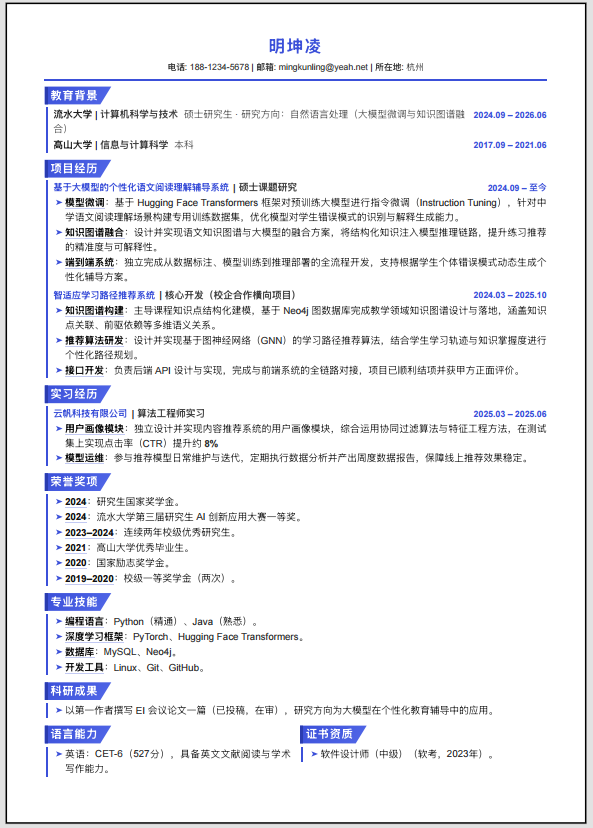
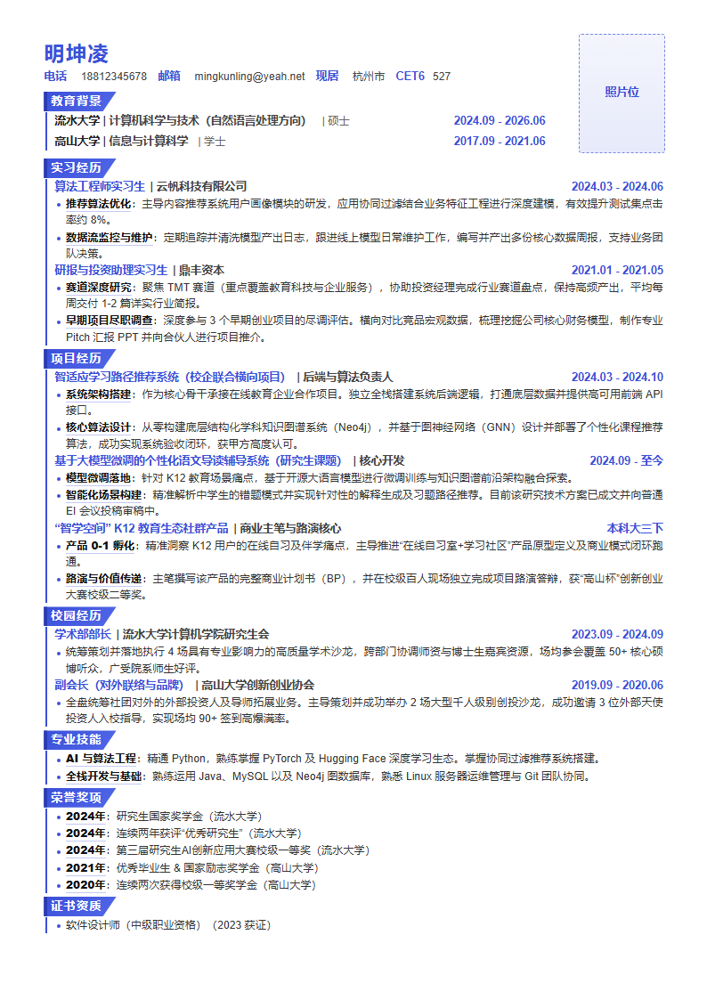
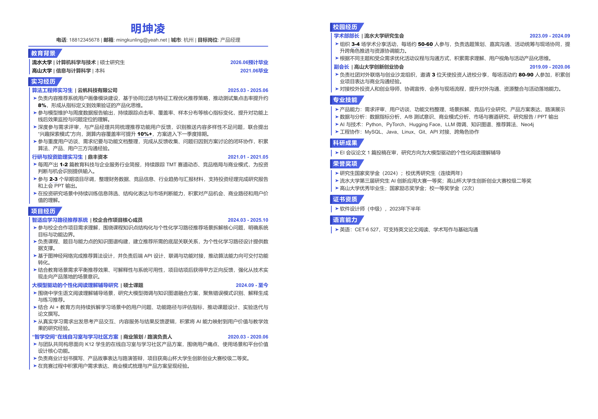
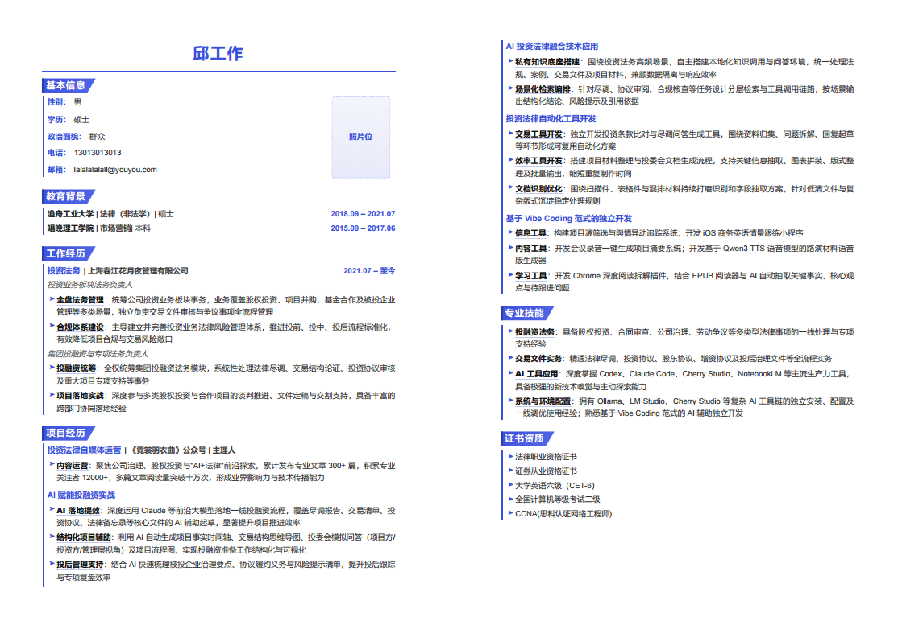

# Resume Pipeline


<p align="left"><strong>语言切换：</strong> <a href="README.md">English</a> | <a href="README_CN.md">简体中文</a></p>

---

<a id="overview-cn"></a>

## 概览

Resume Pipeline 是一个面向最终使用者的三阶段简历生成工作流，用来把杂乱原始素材稳定地转换成正式的 A4 简历。

适用对象：

- 求职者
- 职业规划顾问与简历服务团队
- 需要结构化、可验证交付流程的简历生成项目

支持的输入包括：

- `PDF`、`DOCX`、`TXT`、`HTML`、`RTF`、`TEX`
- 手写草稿和零散笔记
- 聊天记录与面试整理稿
- 语音转写或口语化原始文本

<a id="what-it-does-cn"></a>

## 可以做什么

- 把原始文件和非结构化文本转换成规范化 Markdown 原料。
- 按目标岗位、公司或 JD 重构简历内容。
- 输出 ATS 友好的标准 section 结构。
- 生成固定 A4 版式，而不是只做松散的样式美化。
- 支持单页、多页、带照片、不带照片四种版式模式。


## 版式模式

当前支持四个显式版式：

- `Single-Page No Photo`
- `Single-Page With Photo`
- `Multi-Page With Photo`
- `Multi-Page No Photo`

## 工作流结构

### Stage 1：`1-template-to-md`

- 读取原始文件或原始文本。
- 提取文本和基本结构。
- 输出标准原料 `raw_content.md`。

### Stage 2：`2-transcriptor`

- 将原料重构为专业简历正文。
- 结合目标岗位或 JD 做内容匹配。
- 统一 ATS 兼容的 section 标题。
- 去除独立的 `Summary`、`个人总结`、自我评价类 section。
- 输出 `refined_resume.md`。

### Stage 3：`3-pdf-generator`

- 将 Markdown 映射为固定 HTML 结构。
- 根据版式选择对应 CSS 分支。
- 在需要时执行浏览器测量与单页收敛。
- 导出最终 A4 PDF。

## 目录结构

```text
.
├── README.md
├── README_CN.md
├── LICENSE
├── assets/
│   └── readme/
│       ├── case-single-page-no-photo.png
│       ├── case-single-page-photo.png
│       ├── case-multipage-no-photo.png
│       └── case-multipage-photo.png
└── resume-pipeline/
    ├── SKILL.md
    ├── 1-template-to-md/
    ├── 2-transcriptor/
    ├── 3-pdf-generator/
    └── validators/
```

<a id="gallery-cn"></a>

## 案例图


<table>
  <tr>
    <td align="center" width="50%">
      
      <br>
      <sub><b>Single-Page No Photo</b></sub>
    </td>
    <td align="center" width="50%">
      
      <br>
      <sub><b>Single-Page With Photo</b></sub>
    </td>
  </tr>
  <tr>
    <td align="center" width="50%">
      
      <br>
      <sub><b>Multi-Page No Photo</b>（第一页与第二页横向拼接）</sub>
    </td>
    <td align="center" width="50%">
      
      <br>
      <sub><b>Multi-Page With Photo</b>（第一页与第二页横向拼接）</sub>
    </td>
  </tr>
</table>

<a id="usage-cn"></a>

## 使用方法

### 推荐方式：Agent 工作流

在支持 Agent 的环境中，直接让系统读取顶层工作流说明：

```text
请读取 resume-pipeline/SKILL.md，并根据我提供的原始材料生成简历。
目标岗位：[公司 + 岗位] 或 [JD 文本]。
版式模式：Single-Page No Photo / Single-Page With Photo / Multi-Page With Photo / Multi-Page No Photo。
```

典型输入：

- 一份或多份原始简历文件
- 粘贴的笔记或草稿
- 目标岗位或 JD
- 可选的版式要求

典型输出：

- `raw_content.md`
- `refined_resume.md`
- `index.html`
- `output_resume.pdf`（最终的简历产品）

### 本地工作流开发

- 顶层协议定义在 `resume-pipeline/SKILL.md` 和各阶段目录中。
- 校验脚本位于 `resume-pipeline/validators/`。
- 可复用的本地渲染 helper 位于 `resume-pipeline/3-pdf-generator/scripts/`。

## 校验机制

仓库内置了 Stage 2 到 Stage 3 的校验脚本：

- `resume-pipeline/validators/validate_stage2.py`
- `resume-pipeline/validators/validate_stage3.py`

这些校验用于确认：

- 关键产物是否存在
- Stage 2 输出在进入排版前是否结构干净
- 单页 PDF 是否在最终导出后仍然保持单页

<a id="updates-cn"></a>

## v2.4.0 更新内容

### 内容改写规则更新

更新位置：

- `resume-pipeline/2-transcriptor/SKILL.md`
- `resume-pipeline/validators/validate_stage2.py`

更新内容：

- 最终简历中禁止保留独立的 `Summary`、`个人总结`、自我评价类 section
- 单页模式的文本密度上限适度放宽
- 单页带照片分支的 Stage 2 扩容边界更明确

### 系统更新

更新位置：

- `resume-pipeline/3-pdf-generator/SKILL.md`
- `resume-pipeline/3-pdf-generator/references/`
- `resume-pipeline/3-pdf-generator/resources/`

更新内容：

- 版式入口统一为四个显式模式
- `Single-Page With Photo` 现在是独立分支，不再视为普通单页变体
- 多页带照片与不带照片分支的说明更清晰

### 渲染与校验辅助更新

更新位置：

- `resume-pipeline/3-pdf-generator/scripts/`
- `resume-pipeline/validators/validate_stage3.py`

更新内容：

- 新增并补齐了单页带照片、多页带照片、多页不带照片的本地渲染 helper
- Stage 3 对最终版式一致性和产物完整性的检查更严格

<a id="license-cn"></a>

## 许可证

GPL-3.0
